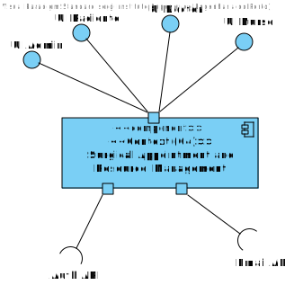
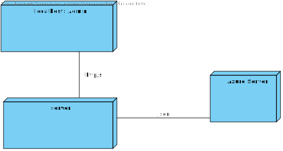
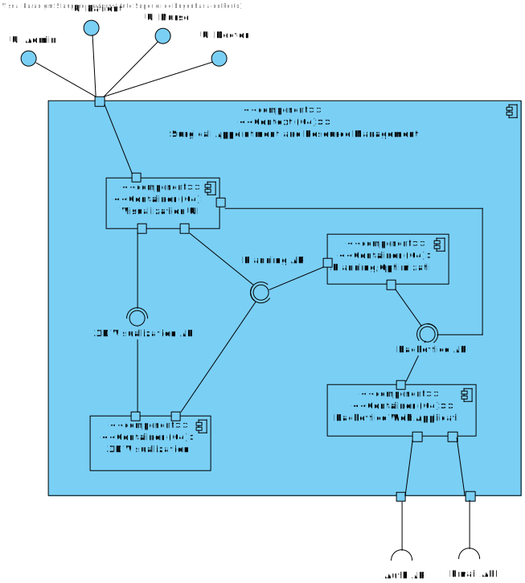
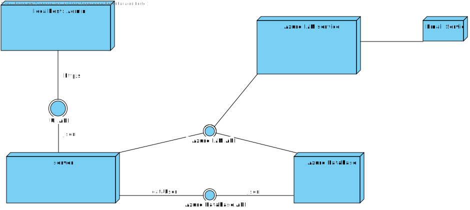
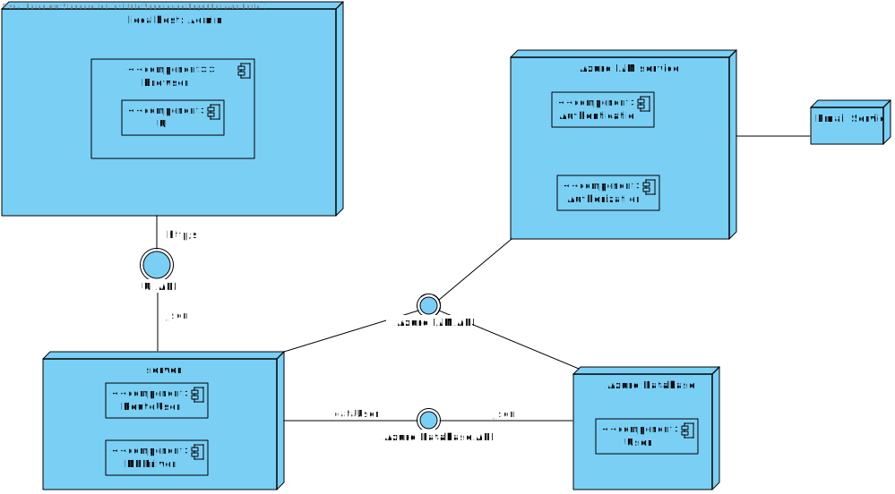

# US 5.1.10 - As an Admin, I want to delete a patient profile, so that I can remove patients who are no longer under care

---

## Table of Contents

- [1. Analysis](#1-analysis)
    - [1.1. Domain Model Excerpt](#11-domain-model-excerpt)
- [2. Design](#2-design)
    - [2.1. Level 1](#21-level-1)
        - [2.1.1. Logical View](#211-logical-view)
        - [2.1.2. Physical View](#212-physical-view)
    - [2.2. Level 2](#22-level-2)
        - [2.2.1. Logical View](#221-logical-view)
        - [2.2.2. Physical View](#222-physical-view)
    - [2.3. Level 3](#23-level-3-)
        - [2.3.1. Logical View](#231-logical-view)
        - [2.3.2. Physical View](#232-physical-view)

## 1. Analysis

### 1.1 Domain Model Excerpt

## 2. Design

### 2.1. Level 1

#### 2.1.1. Logical View

#### 2.1.2. Physical View

### 2.2. Level 2

#### 2.2.1. Logical View

#### 2.2.2. Physical View

### 2.3. Level 3

#### 2.3.1. Logical View

#### 2.3.2. Physical View

