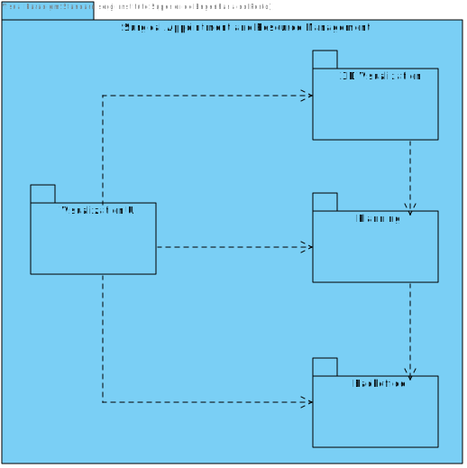

# US 5.1.8 - As an Admin, I want to create a new patient profile, so that I can register their personal details and medical history.

---

## Table of Contents

- [1. Implementation](#1-implementation)
    - [2.1. Level 1](#21-level-1)
        - [2.1.1. Implementation View](#211-logical-view)
        - [2.1.2. Process View](#212-physical-view)
    - [2.2. Level 2](#22-level-2)
        - [2.2.1. Implementation View](#221-logical-view)
        - [2.2.2. Process View](#222-physical-view)
    - [2.3. Level 3](#23-level-3)
        - [2.3.1. Implementation View](#231-logical-view)
        - [2.3.2. Process View](#232-physical-view)

## 1. Implementation

### 2.1. Level 1

#### 2.1.1. Implementation View

#### 2.1.2. Process View

### 2.2. Level 2

#### 2.2.1. Implementation View

#### 2.2.2. Process View

### 2.3. Level 3

#### 2.3.1. Implementation View

#### 2.3.2. Process View

