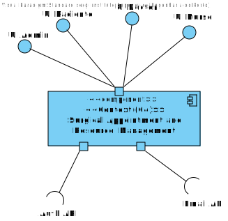

# US 5.1.3 - As a Patient, I want to register for the healthcare application, so that I can create a user profile and book appointments online.

---

## Table of Contents

- [1. Analysis](#1-analysis)
  - [1.1. Domain Model Excerpt](#11-domain-model-excerpt)
- [2. Design](#2-design)
  - [2.1. Level 1](#21-level-1)
    - [2.1.1. Logical View](#211-logical-view)
  - [2.2. Level 2](#22-level-2)
    - [2.2.1. Logical View](#221-logical-view)
    - [2.2.2. Implementation View](#222-implementation-view)
  - [2.3. Level 3](#23-level-3-)
    - [2.3.1. Logical View](#231-logical-view)

  

## 1. Analysis

### 1.1 Domain Model Excerpt

## 2. Design

### 2.1. Level 1

#### 2.1.1. Logical View

### 2.2. Level 2

#### 2.2.1. Logical View

#### 2.2.2. Implementation View

### 2.3. Level 3 

#### 2.3.1. Logical View

